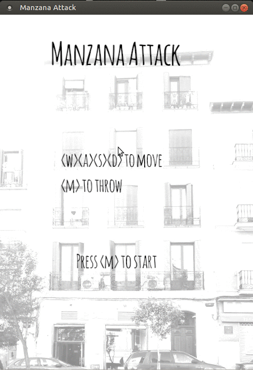

# Manzana Attack

A game about throwing apples at random people. Based on a true story.



## Why

This is a project to learn the Rust progamming lanuguage and the [Piston game engine](http://www.piston.rs/).

## Building and running

You need to have Rust/ Cargo installed. Then run
```bash
$ cargo build
```

And run the `manzana-attack` binary in `target/debug`.

## Assets

Aside from `house.jpg` and `house-start.jog` all assets are free to use and can be found on these amazing platforms:
- [Fonts on fontsquirrel.com](https://www.fontsquirrel.com/)
- [Art on opengameart.org](https://opengameart.org/)
- [Sounds on freesound.org](https://freesound.org/)
